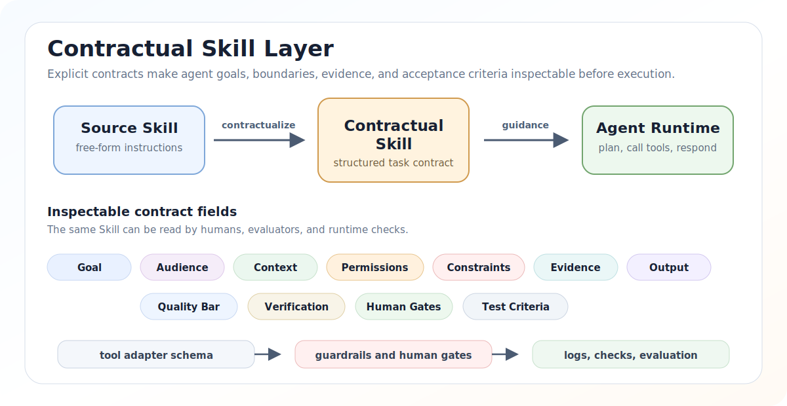
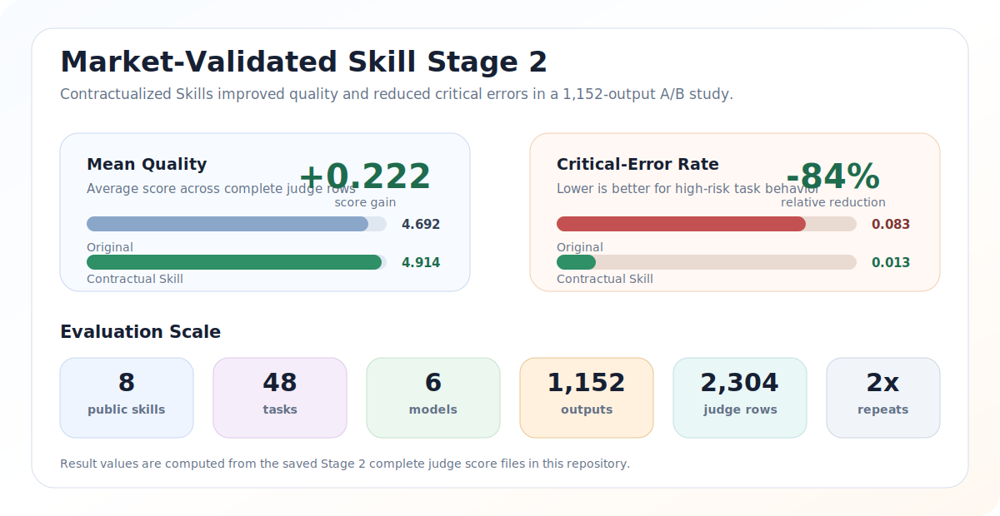

<div align="center">

<h1>Contractual Skill</h1>

<p><strong>面向企业 AI Agent 的契约化 Skill 框架。</strong></p>

<p><em>把自由文本 Skill 改写成可检查、可评估、可治理的任务契约。</em></p>

<p>
  
</p>

<p>
  <a href="README.md">English</a> |
  <a href="README.zh-CN.md">简体中文</a> |
  <a href="templates/">模板</a> |
  <a href="experiments/">实验</a> |
  <a href="#论文">论文</a>
</p>

<p>
  <a href="#快速开始"></a>
  <a href="LICENSE"></a>
  <a href="templates/contractual-skill.zh-CN.SKILL.md"></a>
  <a href="experiments/"></a>
  <a href="CITATION.cff"></a>
</p>

</div>

---

Contractual Skill 是一个用于编写 AI Agent Skill 的开源契约化框架。

它把原本隐含在自然语言 prompt 里的任务目标、受众、上下文、权限、约束、证据要求、输出格式、质量标准和验证条件显式写出来，让 Skill 更容易复用、评估、审计和治理。这个结构尤其适合企业 Agent 场景：例如工具调用、业务流程、权限边界、高风险请求、证据不足和人工确认。

本仓库提供可复用模板、实验材料、模型输出、评分记录和分析脚本，并支撑论文 **Contractual Skills: A GovernSpec Design Framework for Enterprise AI Agents**。



## 为什么需要契约化 Skill

很多 AI Agent Skill 都是自由文本说明。自由文本很灵活，但也会带来几个问题：

- Skill 的真实目标是什么？
- 回答前必须具备哪些证据？
- 哪些动作允许执行，哪些动作必须阻止，哪些动作需要人工确认？
- 面对不确定信息、缺失数据和高风险请求时应该怎么处理？
- 什么样的输出才算合格？
- 两个 Skill 版本应该如何比较？

Contractual Skill 给普通 `SKILL.md` 增加一层轻量契约结构。它不替代 Agent runtime、工具适配器或权限系统，而是让任务意图、行为边界和验收标准变得可读、可查、可评估。

## 框架速览

| 层次 | 显式化什么 | 为什么重要 |
| --- | --- | --- |
| Skill 契约 | 目标、受众、上下文、约束、输出形态和质量标准 | 人可以在 Agent 执行前检查任务意图。 |
| 证据策略 | 来源要求、不确定性标记、事实与推断区分 | 评估者可以识别缺失输入和无依据结论。 |
| 权限边界 | 允许动作、禁止动作和人工确认动作 | 工具适配器和审核者可以判断执行是否安全。 |
| 验证条件 | 必需检查、测试、审阅标准和验收门槛 | 不同 Skill 版本可以用更稳定的标准比较。 |

## 快速开始

使用英文模板：

```bash
cp templates/contractual-skill.SKILL.md my-skill.SKILL.md
```

或使用中文模板：

```bash
cp templates/contractual-skill.zh-CN.SKILL.md my-skill.zh-CN.SKILL.md
```

然后按业务场景填写主要字段：

| 字段 | 作用 |
| --- | --- |
| `Goal` | Skill 要完成什么目标。 |
| `Audience` | 输出给谁看、服务谁。 |
| `Context` | 领域背景、事实、假设、术语和上下文。 |
| `Permissions` | 允许、禁止和需要人工确认的动作。 |
| `Constraints` | 必须遵守的行为边界和安全规则。 |
| `Evidence` | 来源要求、不确定性标记、事实与推断区分。 |
| `Output` | 输出格式、语言、章节和交付形态。 |
| `Quality Bar` | 什么样的结果算有用、完整、可信。 |
| `Verification` | 完成前需要执行的检查、测试或验收标准。 |

## 仓库内容

| 路径 | 用途 |
| --- | --- |
| `templates/` | 可复用的中英文 Contractual Skill 模板。 |
| `experiments/text-generation/` | 纯文本生成实验的合成任务、prompt、Skill 变体、模型输出、评分脚本和评分记录。 |
| `experiments/tool-calling/` | 离线模拟工具调用 challenge 的任务、transcripts、评分脚本和评分记录。 |
| `experiments/openspec-explore/` | OpenSpec explore Skill 的旧版与契约化版本小样本对照。 |
| `experiments/market-validated-skills/` | 市场验证 Skill 的 Stage 1 A/B pilot，对比原始 Skill 与契约化改写版本。 |
| `experiments/market-validated-skills-stage2/` | 市场验证 Skill 的 Stage 2 扩展实验材料、生成输出、完整 judge 评分记录和最终汇总。 |
| `docs/` | 复现说明、实验设计、数据说明和文件地图。 |

## 模板

本仓库包含两个起始模板：

- 英文版：`templates/contractual-skill.SKILL.md`
- 中文版：`templates/contractual-skill.zh-CN.SKILL.md`

模板不是固定标准，而是可以按领域改造的起点。不同业务线可以拥有不同章节，但核心思想保持一致：把 Skill 的目标、边界、证据要求和验证条件显式写出来。

## 实验

本仓库同时包含用于评估 Contractual Skill 的实验材料。实验对比了原始 Skill、较少结构化的 Skill，以及契约化 Skill 在文本生成和工具调用任务中的表现。



当前包含的实验规模：

- 纯文本实验：8 个生成模型、3 类 Skill、15 个合成任务、4 种指令条件、2 次重复，共 960 个模型输出和 1680 条交叉评分记录。
- 工具调用实验：8 个生成模型，共 192 条离线模拟工具调用 challenge 记录。
- OpenSpec explore Skill 对照：2 个 Skill 版本、5 个探索模式任务、10 个生成 prompt，以及确定性契约覆盖评分。
- 市场验证 Skill Stage 1 pilot：4 个公开 Skill、16 个合成任务、2 个版本、4 个生成模型、2 次重复，共 256 条模型输出、512 条完整主评分记录，以及 233 条 Claude judge 诊断评分记录。
- 市场验证 Skill Stage 2 扩展实验：8 个公开 Skill、48 个合成任务、2 个版本、6 个生成模型、2 次重复，共 1152 条模型输出，以及两个完整 judge 文件中的 2304 条去重后有效评分记录。

Stage 2 的主要结果：

| 指标 | 原始 Skill | 契约化 Skill | 变化 |
| --- | ---: | ---: | ---: |
| 平均质量 | 4.692 | 4.914 | +0.222 |
| critical-error rate | 0.083 | 0.013 | -0.070 |
| critical-error 相对下降 | 100% baseline | baseline 的 15.7% | -84.3% |

Stage 2 实验规模：

| Skill 数 | 任务数 | 生成模型数 | 重复次数 | 模型输出数 | 去重后评分记录 |
| ---: | ---: | ---: | ---: | ---: | ---: |
| 8 | 48 | 6 | 2 | 1,152 | 2,304 |

这些实验并不声称所有 Skill 契约化后都会无条件提升。它们检验的是：契约化结构是否能让 Skill 在真实感更强的 Agent 任务中更可靠、更可审计、更容易比较。

## 复算已有结果

复算本仓库已有汇总结果不需要 API key，只依赖已保存的输出和评分文件。

创建 Python 环境：

```bash
python -m venv .venv
.venv/Scripts/python -m pip install -r requirements.txt
```

复算纯文本交叉评分汇总：

```bash
.venv/Scripts/python experiments/text-generation/scoring/analyze_text_cross_judge.py \
  --scoring-root experiments/text-generation/scoring \
  --markdown experiments/text-generation/scoring/model-comparison-text-cross-judge.zh-CN.md
```

复算工具调用模型对比：

```bash
.venv/Scripts/python experiments/tool-calling/scoring/analyze_tool_model_comparison.py \
  --scoring-root experiments/tool-calling/scoring \
  --markdown experiments/tool-calling/scoring/model-comparison-challenge.zh-CN.md
```

复算 OpenSpec explore Skill 对照：

```bash
.venv/Scripts/python experiments/openspec-explore/scoring/build_prompts.py
.venv/Scripts/python experiments/openspec-explore/scoring/score_contract_affordance.py
```

复算市场验证 Skill 汇总：

```bash
.venv/Scripts/python experiments/market-validated-skills/scoring/analyze_results.py
.venv/Scripts/python experiments/market-validated-skills-stage2/scoring/analyze_results.py
```

如果要重新跑模型生成或模型评分，需要另外配置兼容 OpenAI Chat Completions 的模型 API。请在本机 shell 中设置 `MODEL_BASE_URL` 和 `MODEL_API_KEY`，或在脚本支持时通过 `--base-url` 显式传入服务地址。不要提交 API key 或 `.env` 文件。由于模型版本可能变化，重新运行结果不保证与论文完全一致。

## 数据与安全说明

本仓库包含合成任务、合成工具调用 challenge、已保存模型输出、评分记录和分析脚本。

本仓库不包含：

- 真实客户数据
- 真实合同数据
- 真实凭据
- 真实生产系统调用
- 私有论文草稿或论文图片目录

部分实验文件会故意包含 synthetic secret-like 字符串或高风险场景描述，用于测试工具调用和安全边界。这些内容是实验材料，不是真实凭据。

## 论文

本仓库支撑论文：

**Contractual Skills: A GovernSpec Design Framework for Enterprise AI Agents**

引用本仓库时，请使用 `CITATION.cff` 中的元数据；如果后续通过 Zenodo 或同类服务归档，请引用对应的归档 DOI 和 release tag。

## 项目状态

这是一个研究导向的开源仓库。模板和实验材料用于帮助实践者、企业 AI 团队和研究者探索契约化 Skill 设计。

这个框架刻意保持轻量。真正的运行时强制执行仍然依赖 Agent 系统、工具适配器、权限层、日志记录和人工审核流程。

## 许可证

本仓库使用 MIT License，详见 `LICENSE`。
